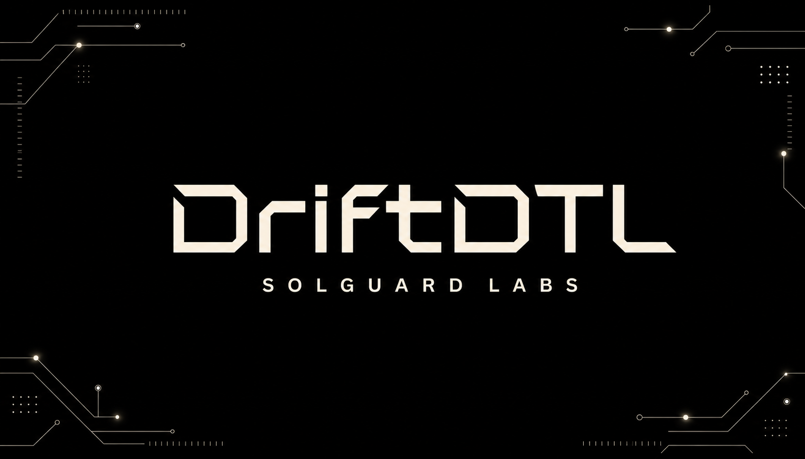
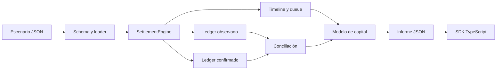
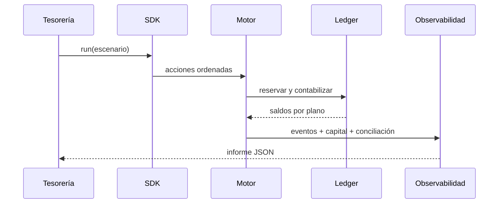
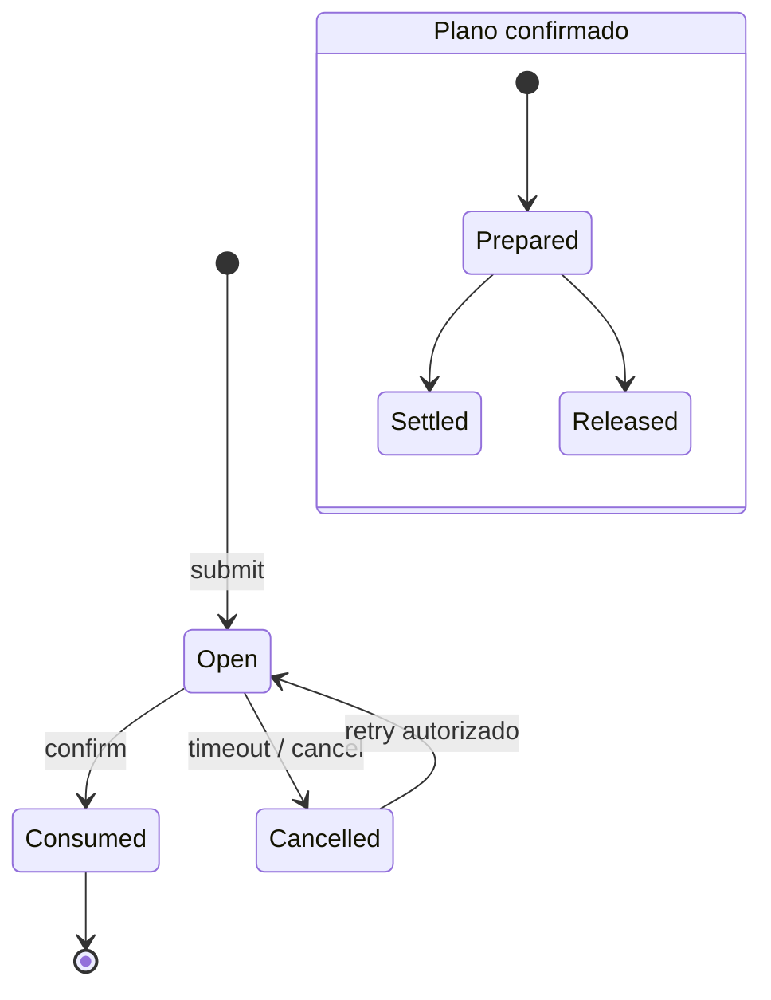

<p align="center">
  
</p>

# DriftDTL

[](https://github.com/SolguardLabs/DriftDTL/actions/workflows/ci.yml)
[](https://github.com/SolguardLabs/DriftDTL/actions/workflows/release-integrity.yml)
[](https://isocpp.org/)
[](https://nodejs.org/)

DriftDTL es un motor determinista de liquidación asíncrona para redes con finalización diferida.
Coordina reservas, confirmaciones, reintentos, prioridades y conciliación por activo sin depender de
servicios externos. El núcleo C++20 ejecuta la máquina de estados; el SDK TypeScript ofrece una
interfaz tipada para sistemas de tesorería, operadores y automatización.

## Capacidades

- doble plano contable para observación y confirmación;
- políticas por canal con límites, comisiones, expiración y reintentos;
- cantidades enteras y aritmética comprobada;
- priorización determinista de la cola por urgencia y antigüedad;
- recibos compactos con huella estable;
- replay de eventos, conciliación por activo e inspección de invariantes;
- modelo de capital con utilización, cobertura, solapamiento y exposición expirada;
- salida JSON estable y cliente TypeScript sin red.

## Arquitectura



El ejecutable procesa una secuencia completa en memoria y entrega una instantánea reproducible. No
abre sockets, no ejecuta procesos secundarios y no persiste secretos.



## Modelo económico

Para un importe bruto `G` y una comisión `f` expresada en puntos básicos:

```text
fee = floor(G × f / 10 000)
net = G - fee
```

El modelo calcula por activo:

```text
operating_base = liquid + observed_commitments
observed_utilization_bps = observed_commitments × 10 000 / operating_base
confirmation_coverage_bps = operating_base × 10 000 / confirmed_commitments
overlap_bps = min(observed, confirmed) × 10 000 / max(observed, confirmed)
```

Cuando no existen compromisos confirmados, la cobertura publicada es `10 000` bps. Los cocientes se
calculan con acumuladores amplios y se acotan para mantener un contrato JSON estable.



## Inicio rápido

Requisitos:

- Node.js 22 o 24;
- compilador C++20: GCC, Clang o MSVC;
- CMake 3.22 o superior si se utiliza el flujo nativo.

```bash
npm ci
npm run build
npm test
```

Validar y ejecutar un escenario:

```bash
out/driftdtl validate tests/fixtures/balanced_settlement.json
out/driftdtl run tests/fixtures/balanced_settlement.json --json --events
```

En Windows, el ejecutable se encuentra en `out/driftdtl.exe`. El script detecta Visual Studio Build
Tools, Clang y GCC.

## SDK TypeScript

```ts
import { DriftClient, capitalBand, headroom } from "./client/src/index.ts";

const client = new DriftClient({ cwd: process.cwd(), timeoutMs: 10_000 });
const report = client.run("tests/fixtures/balanced_settlement.json");
const asset = report.capital.assets[0];

console.log({
  asset: asset.asset,
  band: capitalBand(asset),
  headroom: headroom(asset, 7_500),
});
```

El cliente usa argumentos estructurados, desactiva el shell, limita tiempo y memoria de salida, y
elimina los archivos temporales de una simulación al finalizar.

## Contrato de escenario

Cada archivo declara cuentas, balances, canales y acciones ordenadas por epoch. Los importes son
unidades enteras no negativas; no se admiten decimales ni notación exponencial.

```json
{
  "name": "daily clearing",
  "startEpoch": 0,
  "accounts": [
    { "id": "treasury", "balances": [{ "asset": "dUSD", "available": 500000 }] },
    { "id": "merchant", "balances": [{ "asset": "dUSD", "available": 0 }] },
    { "id": "operator", "balances": [{ "asset": "dUSD", "available": 0 }] }
  ],
  "lanes": [
    {
      "id": "usd-prime",
      "asset": "dUSD",
      "operator": "operator",
      "policy": {
        "timeoutEpochs": 4,
        "feeBps": 10,
        "maxRetries": 2,
        "minPacketAmount": 1000,
        "maxPacketAmount": 250000
      }
    }
  ],
  "actions": []
}
```

## Verificación

`npm run ci` ejecuta compilación con advertencias como errores, pruebas funcionales, typecheck,
formato y validación de artefactos. GitHub Actions repite el proceso en Ubuntu y Windows con Node.js
22 y 24. CMake se valida en un trabajo independiente.

## Estructura

| Ruta             | Responsabilidad                                 |
| ---------------- | ----------------------------------------------- |
| `src/core`       | Cantidades, errores, JSON y utilidades de texto |
| `src/domain`     | Identificadores, entidades y prioridades        |
| `src/ledger`     | Saldos, reservas y conciliación por activo      |
| `src/settlement` | Políticas, timeline, cola, recibos y motor      |
| `src/economics`  | Indicadores de capital y exposición             |
| `src/audit`      | Invariantes y replay de eventos                 |
| `src/report`     | Contrato JSON para integraciones                |
| `client/src`     | SDK TypeScript y clasificación de capacidad     |
| `tests`          | Escenarios y verificación de comportamiento     |

## Documentación

- [Arquitectura](./docs/architecture.md)
- [Ciclo de liquidación](./docs/settlement-lifecycle.md)
- [Modelo económico](./docs/economic-model.md)
- [Riesgo y límites](./docs/risk-and-limits.md)
- [Operaciones](./docs/operations.md)
- [Guía de integración](./docs/integration-guide.md)
- [Observabilidad](./docs/observability.md)
- [Política de seguridad](./SECURITY.md)

## Versionado

La rama `main` contiene el estado aprobado. La rama `production` referencia exactamente el commit
publicado. Las versiones estables usan tags anotados `vMAJOR.MINOR.PATCH`; cada publicación verifica
la igualdad entre `main`, `production` y el tag.

## Licencia

Distribuido bajo los términos de [LICENSE](./LICENSE).
