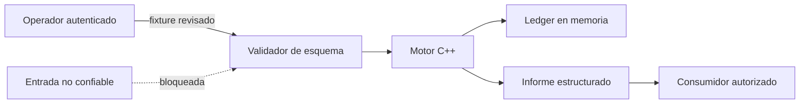
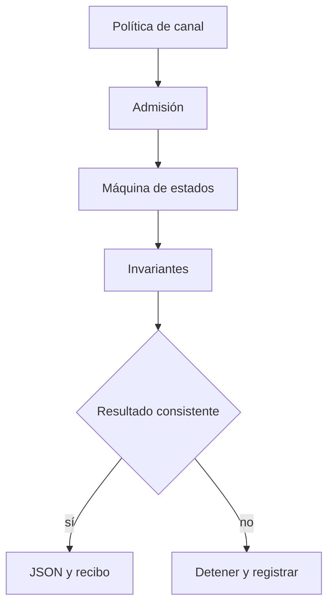
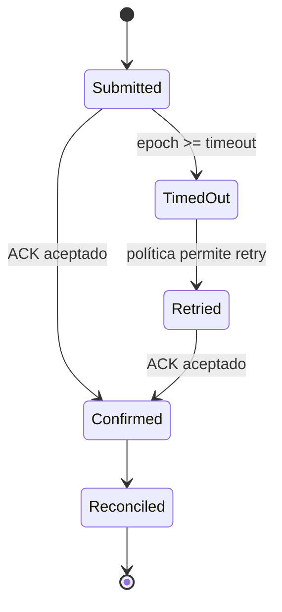

# Seguridad de DriftDTL

## Versiones mantenidas

| Versión | Estado            | Canal             |
| ------- | ----------------- | ----------------- |
| 1.0.x   | Mantenida         | `production`      |
| < 1.0   | Sin mantenimiento | Archivo histórico |

## Comunicación responsable

Los hallazgos de seguridad deben comunicarse mediante **GitHub Security Advisories** del
repositorio. No se deben incluir detalles sensibles en issues, discusiones o pull requests
públicos.

El informe debe contener:

- versión, commit y plataforma;
- precondiciones y alcance;
- secuencia mínima reproducible;
- efecto contable y activos implicados;
- evidencia sin credenciales ni datos personales;
- propuesta de contención si está disponible.

Acusaremos recibo, clasificaremos el impacto y coordinaremos la corrección y publicación. No existe
un SLA contractual, pero los incidentes con efecto sobre integridad contable tienen prioridad
máxima.

## Fronteras de confianza



Se consideran no confiables el contenido de escenarios, las rutas aportadas por integraciones y los
identificadores externos. El binario, su directorio de trabajo y la configuración de despliegue
pertenecen al dominio operativo confiable.

## Objetivos de seguridad

- **Integridad:** una transición debe respetar política, orden temporal y aritmética comprobada.
- **Autenticidad operativa:** cada ACK es identificable y su duplicación es idempotente.
- **Trazabilidad:** toda acción produce eventos y una huella de recibo estable.
- **Disponibilidad:** los límites evitan escenarios, tiempos y salidas sin cota.
- **Confidencialidad:** la ejecución no necesita red ni secretos persistentes.



## Controles implementados

| Superficie     | Control                                                        |
| -------------- | -------------------------------------------------------------- |
| Importes       | Enteros con suma, resta y multiplicación comprobadas           |
| Escenarios     | Esquema, referencias, orden de epoch y extensión `.json`       |
| Paquetes       | ID único, límites por canal y estado previo requerido          |
| Confirmaciones | ACK requerido, conjunto de unicidad y contador de repetición   |
| Reintentos     | Cantidad inmutable y cota configurada                          |
| SDK            | `shell: false`, timeout, buffer acotado y limpieza garantizada |
| Artefactos     | Rama de producción y tag ligados al mismo commit               |
| Dependencias   | Lockfile y revisiones automatizadas mensuales                  |

## Invariantes contables

Para cada activo `a`:

```text
available(a) >= 0
observed_locked(a) >= 0
confirmed_locked(a) >= 0
gross = net + fee
fee = floor(gross × fee_bps / 10 000)
```

Las reservas observadas expresan capacidad operativa; los compromisos confirmados expresan
obligaciones pendientes. El informe conserva ambos valores para conciliarlos de forma independiente.



## Endurecimiento de despliegue

1. Ejecutar `npm ci` desde el lockfile.
2. Ejecutar `npm run ci` en un agente efímero.
3. Publicar solo commits revisados de `main`.
4. Hacer que `production` y el tag anotado apunten al mismo commit.
5. Conservar logs, informe JSON y hash del artefacto.
6. Limitar permisos del runner a lectura salvo durante la publicación.

## Fuera de alcance

El motor no implementa custodia, consenso, transporte de red, gestión de claves ni autenticación
de usuarios. Los sistemas que lo integren deben resolver esas responsabilidades antes de entregar un
escenario al proceso.
