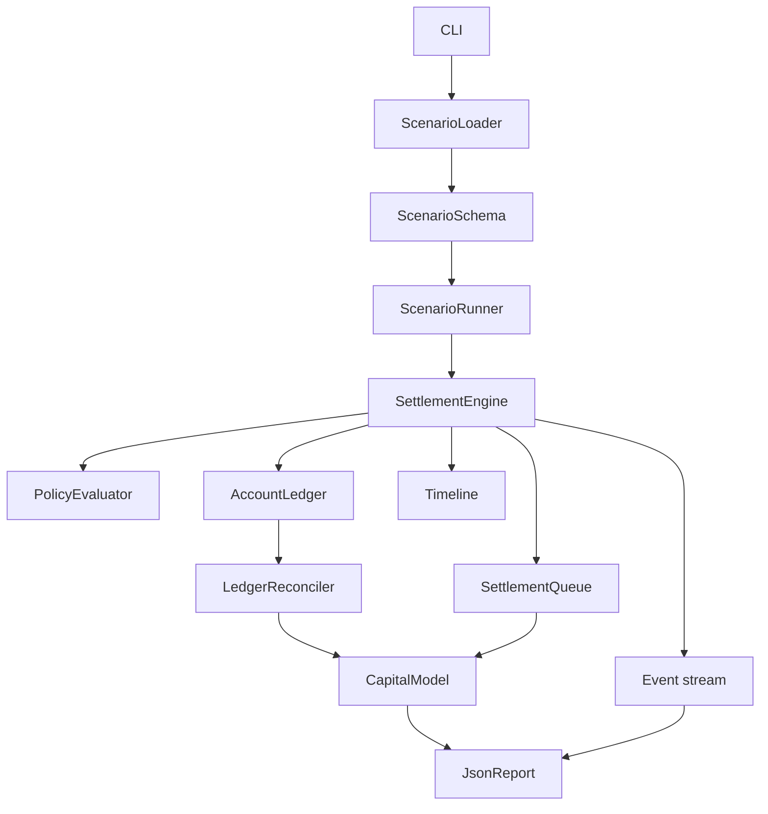
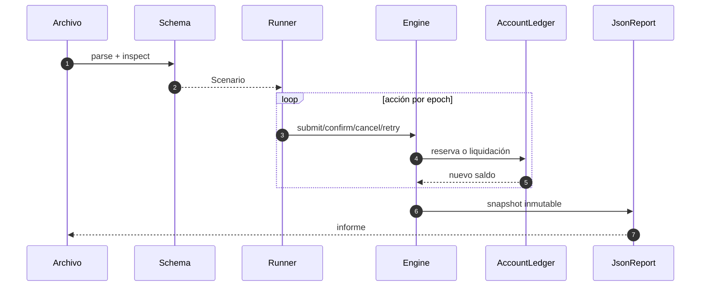
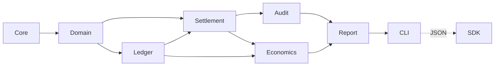

# Arquitectura

## Propósito

DriftDTL separa validación, dominio, contabilidad y presentación para que cada transición pueda
reproducirse con la misma entrada. El proceso es deliberadamente monolítico: reduce dependencias de
ejecución y deja la orquestación distribuida en manos de la plataforma integradora.

## Mapa de componentes

| Capa       | Entrada           | Salida            | Garantía principal              |
| ---------- | ----------------- | ----------------- | ------------------------------- |
| Core       | escalares y texto | tipos comprobados | sin desbordamientos silenciosos |
| Domain     | configuración     | entidades tipadas | identificadores no vacíos       |
| Scenario   | JSON              | secuencia válida  | referencias y epochs coherentes |
| Settlement | acciones          | estados y eventos | orden determinista              |
| Ledger     | movimientos       | saldos por plano  | reservas no negativas           |
| Economics  | estado completo   | ratios por activo | métricas comparables            |
| Report     | agregados         | JSON estable      | claves y unidades explícitas    |

## Flujo de datos

El loader no modifica el estado. El runner es el único adaptador entre acciones y comandos del
motor. El informe consulta interfaces de solo lectura, de modo que observar no cambia el resultado.

## Dependencias

Las flechas no regresan hacia capas inferiores. Esta regla evita que la serialización o el SDK
condicionen la semántica contable.

## Decisiones técnicas

- C++20 ofrece tipos de valor y control explícito del ciclo de vida.
- El JSON interno evita una dependencia nativa adicional.
- `std::map` mantiene orden estable en cuentas, canales y paquetes.
- Los importes usan `int64_t`; los porcentajes usan puntos básicos.
- El SDK invoca el binario sin shell y conserva el contrato de proceso.
- CMake y el compilador directo son caminos de compilación equivalentes.

## Extensión segura

Una nueva acción requiere actualizar, en este orden, el enum de dominio, el parser, el esquema, el
runner, el motor, los eventos, el informe y las pruebas. Una nueva métrica debe derivarse desde
interfaces de solo lectura y no debe alterar el orden de eventos.
