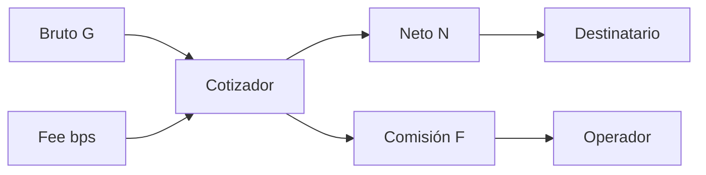
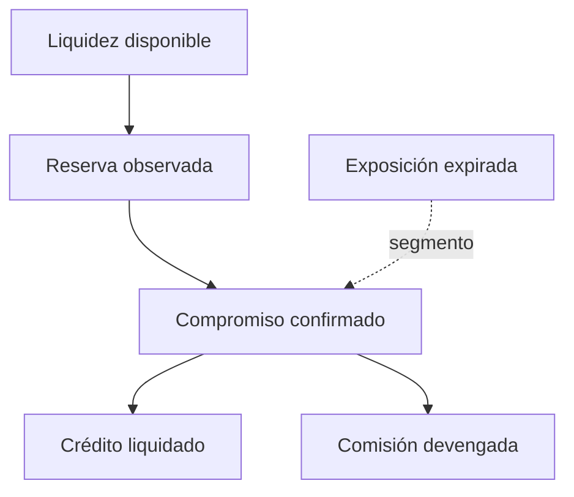
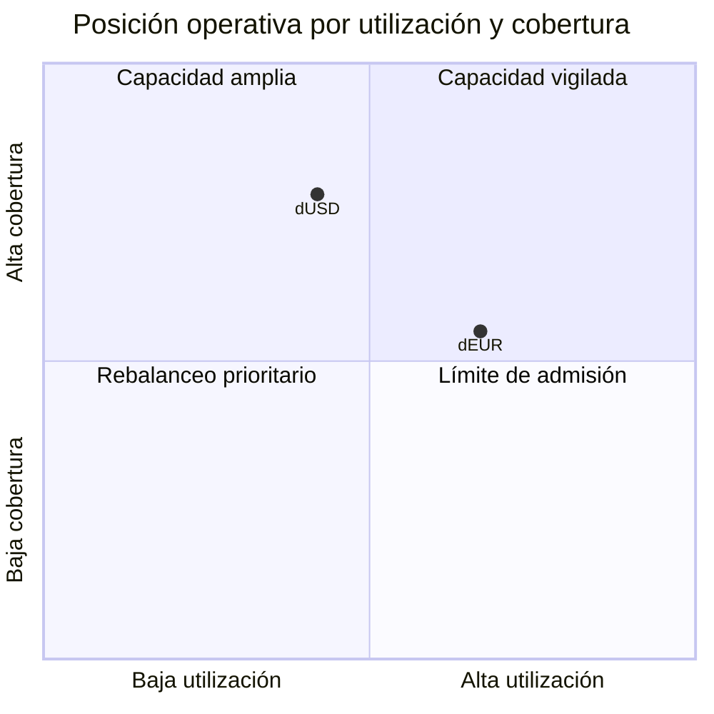
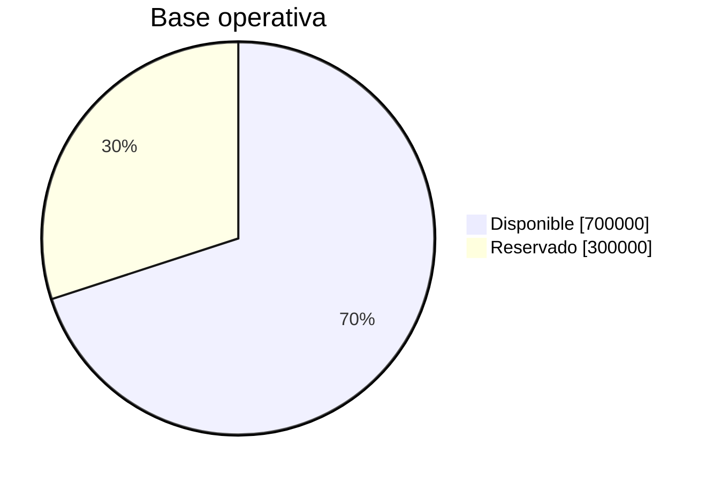

# Modelo económico

## Unidades y redondeo

Los activos se expresan en su unidad mínima. Sea `G` el bruto y `b` la comisión en puntos básicos:

```text
F = floor(G × b / 10 000)
N = G - F
G = N + F
```

El redondeo siempre favorece al principal: la comisión se redondea hacia abajo. El motor rechaza
resultados fuera de `int64_t` y políticas por encima del rango admitido.



## Capas de capital



Las capas no se suman como patrimonio: son vistas operativas con propósitos diferentes. Por eso el
informe presenta liquidez, compromisos y créditos por separado.

## Indicadores

Sea `L` la liquidez, `O` las reservas observadas y `C` los compromisos confirmados:

```text
operating_base = L + O
utilization = O / operating_base
coverage = operating_base / C
overlap = min(O, C) / max(O, C)
```

Todos los ratios se publican en puntos básicos. La cobertura puede superar `10 000`; el contrato la
acota a `1 000 000` bps para impedir valores sin límite en consumidores.



## Límite de capacidad

Para una utilización objetivo `u*`, el SDK estima capacidad adicional:

```text
target_commitments = floor(operating_base × u* / 10 000)
headroom = max(0, target_commitments - O)
```

Este valor es orientativo. La admisión definitiva sigue aplicando los límites por paquete y la
liquidez de la cuenta origen.

## Escenario numérico

Una tesorería dispone de 1.000.000 unidades y reserva 300.000:

| Magnitud            |     Valor |
| ------------------- | --------: |
| Base operativa      | 1.000.000 |
| Reserva observada   |   300.000 |
| Utilización         | 3.000 bps |
| Objetivo            | 7.500 bps |
| Capacidad adicional |   450.000 |



## Conciliación

La conciliación agrupa por activo, no por cuenta. Para cerrar un periodo se comparan los totales del
informe con el mayor contable externo, el hash del escenario y el commit del ejecutable. Las
diferencias deben analizarse por plano antes de compensar saldos.
