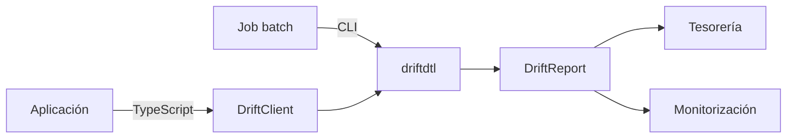
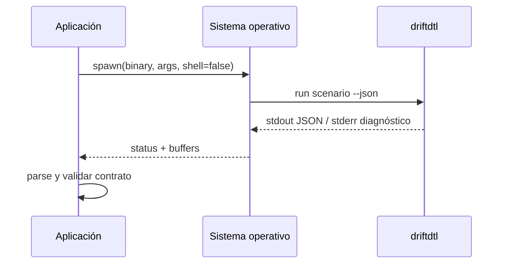
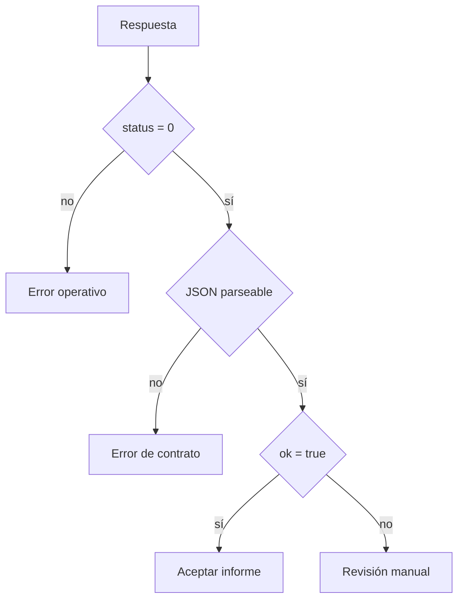

# Guía de integración

## Opciones

DriftDTL ofrece dos superficies: CLI para procesos y SDK TypeScript para aplicaciones Node.js. Ambas
consumen el mismo ejecutable y producen el mismo JSON.



## Cliente tipado

```ts
import { DriftClient } from "./client/src/index.ts";

const client = new DriftClient({
  cwd: process.cwd(),
  timeoutMs: 15_000,
});

if (client.validate("input/clearing.json") !== "ok") {
  throw new Error("invalid scenario");
}

const report = client.run("input/clearing.json", true);
```

`simulate` acepta un objeto `DriftScenario`, lo escribe de forma exclusiva en un directorio temporal,
ejecuta el motor y elimina el directorio incluso cuando la ejecución termina con error.

## Integración por proceso



Reglas:

- no construir una línea de shell con datos externos;
- usar una ruta absoluta al binario;
- imponer timeout y límite de salida;
- tratar stderr como diagnóstico y stdout como contrato;
- no reintentar automáticamente una entrada no válida.

## Manejo de errores

|            Código | Categoría                    | Acción del consumidor                 |
| ----------------: | ---------------------------- | ------------------------------------- |
|                 0 | ejecución aceptada           | procesar JSON                         |
|                 1 | argumento o estado rechazado | revisar stderr, no publicar           |
|       timeout SDK | proceso excedido             | terminar, conservar entrada y alertar |
| JSON no parseable | contrato interrumpido        | aislar artefacto y detener flujo      |



## Idempotencia del consumidor

La clave recomendada es `commit + scenario_sha256`. Los resultados con la misma clave deben
reemplazar una ejecución incompleta, pero nunca acumular movimientos. El recibo de cada paquete sirve
para correlación, no como identificador global de la ejecución.

## Evolución del contrato

El consumidor debe validar tipos requeridos y tolerar propiedades nuevas. La versión del artefacto
se obtiene del tag de despliegue; no se infiere desde los datos del escenario.
