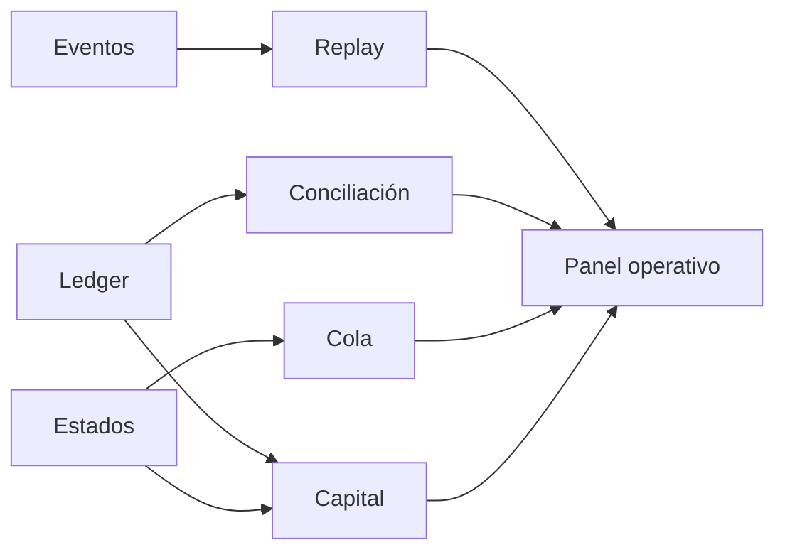
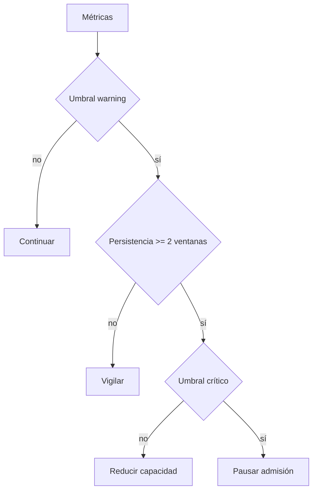
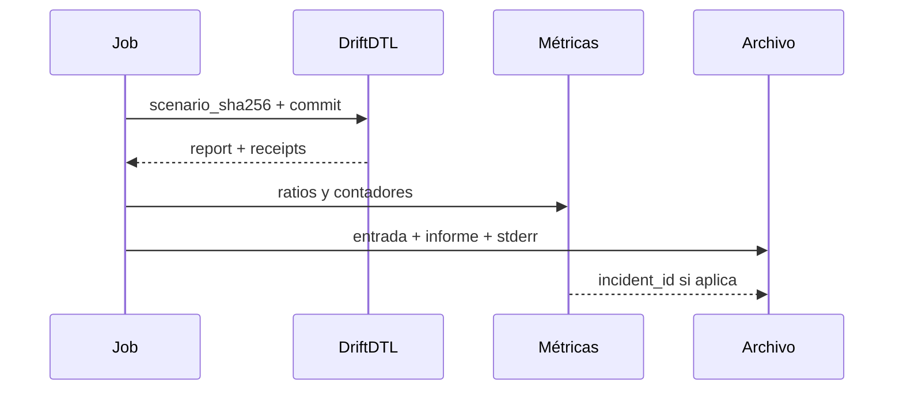

# Observabilidad

## Fuentes de señal

El informe combina resumen, cuentas, settlements, auditoría, replay, cola, conciliación, capital y
eventos opcionales. Cada bloque responde a una pregunta operativa distinta.

## Indicadores recomendados

| Indicador                | Fuente                                     | Dimensión |
| ------------------------ | ------------------------------------------ | --------- |
| paquetes abiertos        | `summary.packetsOpen`                      | entorno   |
| confirmaciones repetidas | `summary.duplicateConfirmations`           | canal     |
| utilización              | `capital.assets[].observedUtilizationBps`  | activo    |
| cobertura                | `capital.assets[].confirmationCoverageBps` | activo    |
| exposición expirada      | `capital.assets[].timeoutExposure`         | activo    |
| profundidad de cola      | `queue.ready/waiting/timedOut`             | entorno   |
| divergencias de plano    | `audit.planeDivergences`                   | entorno   |

## Alertas

Umbrales iniciales:

- warning con utilización superior a 6.000 bps;
- crítico con utilización superior a 8.000 bps;
- warning con cobertura inferior a 15.000 bps;
- crítico con cobertura inferior a 10.000 bps;
- warning cuando `timedOut` crece en dos ventanas consecutivas.

Los umbrales deben calibrarse con datos de cada activo. Una alerta aislada no cambia la contabilidad;
solo activa el runbook correspondiente.

## Correlación

Campos de correlación recomendados:

- hash SHA-256 del escenario;
- commit y tag del binario;
- nombre del escenario;
- epoch inicial y final;
- ID de paquete, canal, activo y recibo;
- ID interno de ejecución del orquestador.

## Retención

Los informes contables deben conservarse según la política financiera aplicable. Los eventos
pueden contener memos suministrados por integraciones; deben clasificarse antes de enviarlos a una
plataforma compartida. No registrar secretos, tokens ni material de claves.

## SLO sugerido

| Objetivo               | Medición                                                      |
| ---------------------- | ------------------------------------------------------------- |
| ejecución determinista | 100 % de hashes de salida iguales para misma entrada y commit |
| escenarios aceptados   | 99,9 % dentro del timeout configurado                         |
| conciliación           | 100 % de periodos con evidencia archivada                     |
| trazabilidad           | 100 % de paquetes con recibo y secuencia temporal             |
