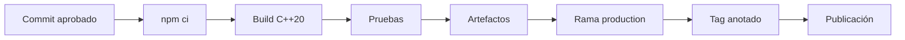
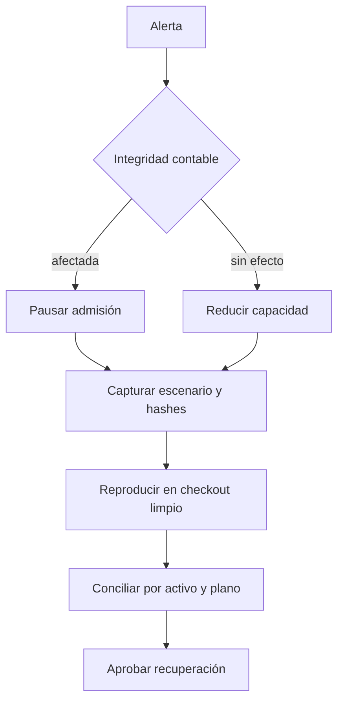
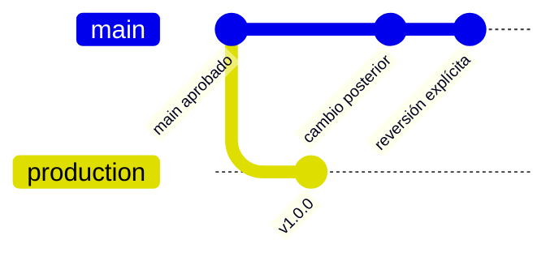

# Operaciones

## Preparación

La ejecución recomendada parte de un checkout limpio y del lockfile. No se requieren bases de datos
ni servicios de red.

```bash
npm ci
npm run ci
```



## Ejecución diaria

1. Validar el escenario.
2. Ejecutarlo con eventos habilitados.
3. Guardar informe, stderr, commit y hash de entrada.
4. Conciliar por activo.
5. Revisar capital y cola.
6. Archivar evidencia conforme a la retención interna.

```bash
out/driftdtl validate input/daily-clearing.json
out/driftdtl run input/daily-clearing.json --json --events > output/daily-clearing.report.json
```

## Runbook de degradación



No se debe editar el escenario original durante el análisis. Las variantes se guardan con un hash
nuevo y una relación explícita con la entrada inicial.

## Despliegue y reversión

`production` y el tag deben apuntar al commit de `main`. Una reversión crea un commit nuevo; no se
mueven tags publicados. La validación de integridad compara los tres refs antes de aceptar el
artefacto.



## Compatibilidad

- Una clave JSON nueva es aditiva dentro de la misma versión mayor.
- Eliminar o renombrar claves requiere versión mayor.
- Las unidades nunca cambian implícitamente.
- Los enums serializados usan minúsculas estables.
- Los consumidores deben ignorar claves desconocidas.

## Evidencia mínima

| Artefacto    | Contenido                         |
| ------------ | --------------------------------- |
| Entrada      | escenario JSON y SHA-256          |
| Ejecución    | stdout, stderr y código de salida |
| Binario      | versión, plataforma y SHA-256     |
| Fuente       | commit y tag anotado              |
| Conciliación | totales por activo y diferencias  |
| Decisión     | aprobador y ventana operativa     |
