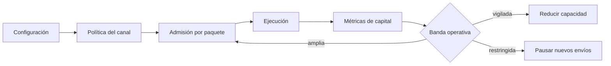
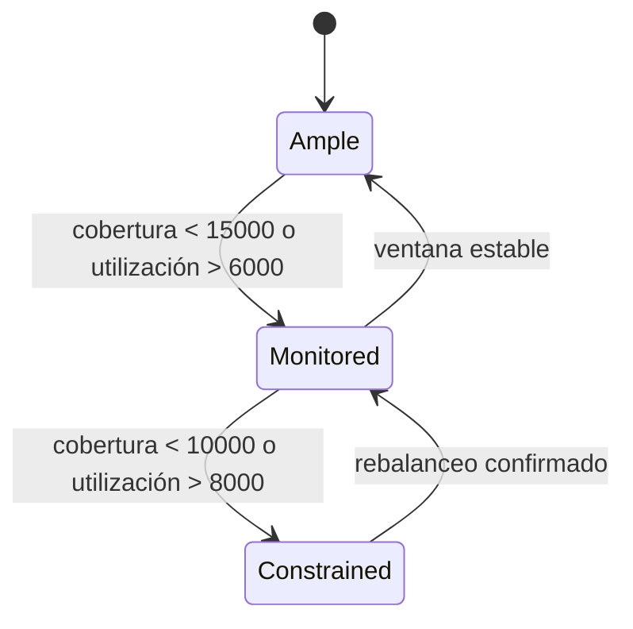
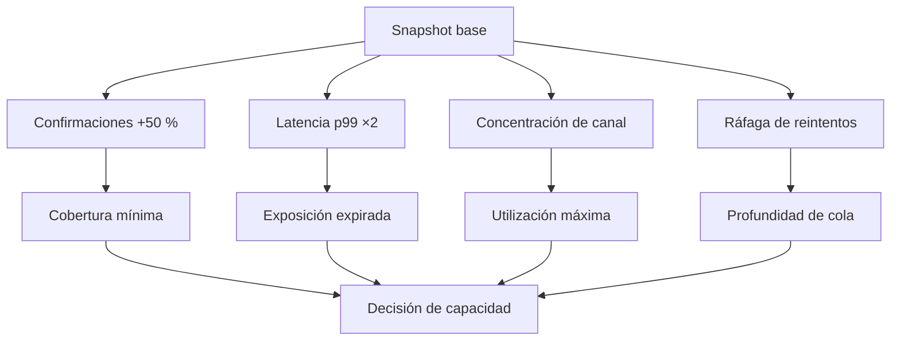

# Riesgo y límites

## Marco operativo

El control se aplica en tres momentos: configuración del canal, admisión del paquete y seguimiento
del capital. Ningún indicador sustituye las reglas duras del motor.

## Límites duros

| Parámetro         | Efecto                           | Recomendación inicial   |
| ----------------- | -------------------------------- | ----------------------- |
| `minPacketAmount` | evita operaciones antieconómicas | coste operativo × 10    |
| `maxPacketAmount` | limita concentración unitaria    | ≤ 5 % de liquidez       |
| `timeoutEpochs`   | acota permanencia en cola        | p99 de confirmación × 2 |
| `maxRetries`      | limita reaperturas               | 1–2                     |
| `feeBps`          | remunera al operador             | gobernanza por activo   |

Los valores dependen de la frecuencia de epoch y del perfil del activo. Un cambio exige simulación
con volumen alto, latencia extrema y secuencias fuera de orden.

## Bandas de capital

El SDK clasifica:

- `ample`: cobertura ≥ 15.000 bps y utilización ≤ 6.000 bps;
- `monitored`: cobertura ≥ 10.000 bps y utilización ≤ 8.000 bps;
- `constrained`: cualquier otra combinación.

## Escenarios de tensión

Una revisión de capacidad debe incluir al menos:

1. volumen nominal y p99 por paquete;
2. participación del mayor origen y destinatario;
3. cobertura mínima por activo;
4. exposición expirada máxima;
5. tiempo de recuperación tras una pausa.

## Respuesta por umbral

| Señal                         | Acción                          |
| ----------------------------- | ------------------------------- |
| Utilización > 8.000 bps       | congelar ampliaciones de límite |
| Cobertura < 10.000 bps        | pausar admisión del activo      |
| Exposición expirada creciente | revisar latencia y cola         |
| ACK repetidos en ráfaga       | aislar integración emisora      |
| Epoch regresivo               | rechazar escenario completo     |

La reactivación requiere un snapshot reconciliado y dos ventanas estables consecutivas.
