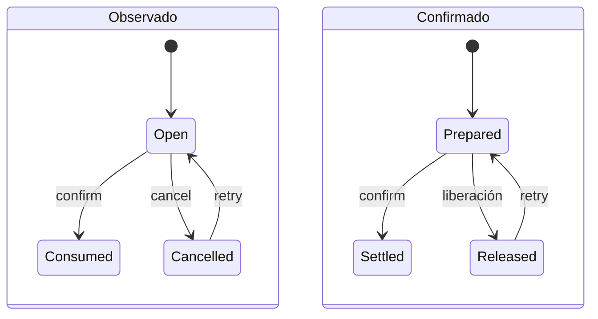
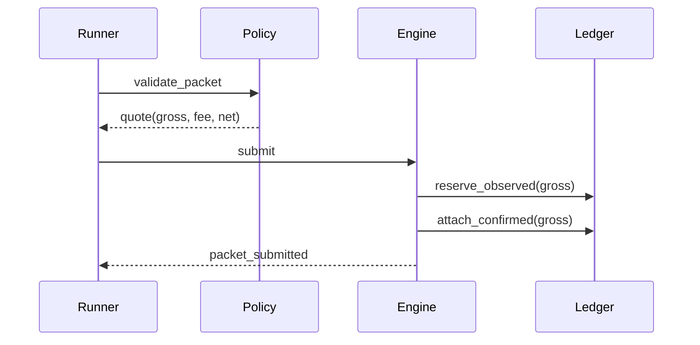
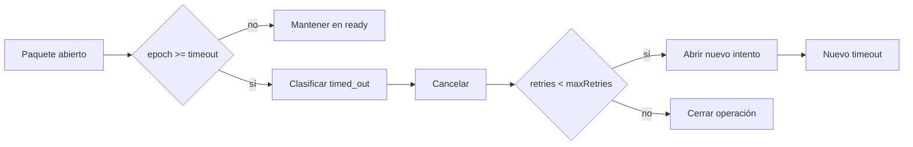

# Ciclo de liquidación

## Estados coordinados

Cada paquete conserva dos estados. El plano observado representa la reserva operativa visible; el
confirmado representa el compromiso que espera finalización. Separarlos permite modelar redes con
latencia sin reducir el proceso a un único booleano.

## Envío

`submit` valida el canal y calcula `gross`, `fee` y `net`. Después reserva el bruto en el plano
observado, adjunta el compromiso confirmado y registra el timeout.

Precondiciones:

- ID de paquete no utilizado;
- canal registrado;
- origen y destinatario declarados;
- importe dentro del rango del canal;
- liquidez observada suficiente;
- epoch no decreciente.

## Confirmación

Un ACK no vacío se incorpora al conjunto del paquete. Si ya existe, la operación se registra como
repetida sin volver a acreditar. El cierre consume la reserva observada cuando está abierta y liquida
el compromiso confirmado entre destinatario y operador.

## Expiración y reintento

Un reintento conserva importe, origen, destinatario y canal. Puede actualizar prioridad y memo. El
contador de intento y el nuevo timeout forman parte del recibo operativo.

## Prioridad de cola

La cola agrupa paquetes en `ready`, `waiting`, `timed_out` y `closed`. Dentro de un grupo, ordena por
puntuación, timeout y ID. La prioridad aporta peso fijo y la antigüedad evita inanición.

## Ejemplo temporal

| Epoch | Acción     | Observado | Confirmado | Cola   |
| ----: | ---------- | --------- | ---------- | ------ |
|     1 | `submit`   | open      | prepared   | ready  |
|     2 | `snapshot` | open      | prepared   | ready  |
|     3 | `confirm`  | consumed  | settled    | closed |

El informe final conserva `observedEpoch`, `timeoutEpoch`, `lastUpdateEpoch`, `attempt`, `ackCount` y
la huella del recibo para reconstruir la decisión.
